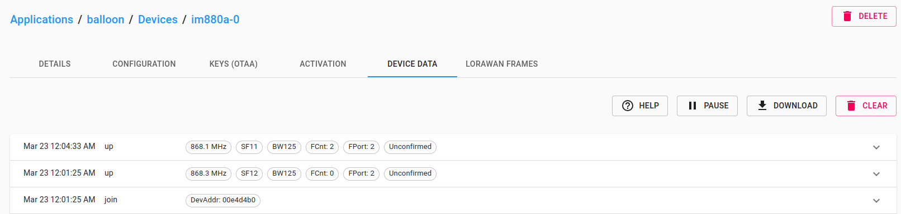
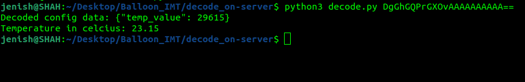

# Balloon_IMT
Proof of concept for transmitting temperature data using coreconf and lora

## About

### [The Balloon Project](https://gricad-gitlab.univ-grenoble-alpes.fr/thingsat/public)

* [dashboard](http://balloon.iot.imag.fr/d/csut1/flight-csut?orgId=1)

### Board: 

* IM880a with lora module and ds75lx temperature sensor
* https://github.com/CampusIoT/tutorial/blob/master/im880a/im880a-ds75lx.md
* https://github.com/CampusIoT/orbimote/tree/master/field_test_device#default-board
* make DEVEUI=BA1100FF73686168 APPEUI=0000000000000000 APPKEY=160A858E86F7440D368F86FE2E620E2F binfile

### Coreconf:

* [pycoreconf](https://github.com/alex-fddz/pycoreconf)
* [ccoreconf](https://github.com/manojgudi/ccoreconf)
* [pyang](https://github.com/ltn22/pyang.git)

### [RIOT OS](https://github.com/manojgudi/RIOT/tree/coreconf-integration)

## Start

1. ``` sudo apt-get install gcc-arm-none-eabi ```

2. PyCoreConf
```
  git clone https://github.com/alex-fddz/pycoreconf.git
  cd pycoreconf
  python3 setup.py install
```
3. PYANG
```
  git clone -b sid-extension https://github.com/ltn22/pyang.git
  cd pyang
  pip install -e .
  cd ..
  pyang --sid-generate-file 1000:300 --sid-list --sid-extension balloon.yang
```
4. RIOT
```
  git clone -b coreconf-integration https://github.com/manojgudi/RIOT.git
  cd RIOT/pkg/coreconf/
  mkdir include
  mkdir src
  cd RIOT
  export RIOTBASE=~/Desktop/RIOT
```
5. Board
```
  git clone https://github.com/CampusIoT/orbimote.git
  cd field_test_device/
  // add the files in field_test_device1 from this repo in this folder
  gmake OTAA=0 DEVEUI=BA1100FF73686168 DEVADDR=260B746C NWKKEY=49069030A0F1E140B27C6E7B8F72323E APPSKEY=B6573D78400E1236BCE862671CC793D3 FCNT_UP=10
  make flash-only
```
6. decode.py should be on the server along with the sid file to decode the CoreConf data received from the board to finally tell the temperature.

## In action



PS: data should be retrieved from the second 'up frame' onwards



